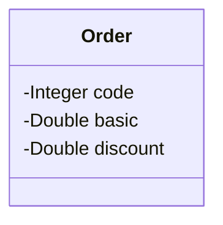
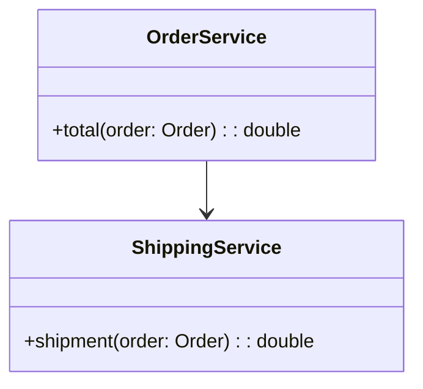

# 📝COMPONENTS AND DEPENDENCY INJECTION
📍 MY LEARN / JAVA / CHALLENGES / DESVSUPERIOR / JAVA SPRING ESSENTIAL<br>
📅 July 25, 2023 - 🚩 São Paulo, Brazil - 🧑‍💻 Mauricio Mityo Hidani<br>


## Rodando o projeto

Versões utilizadas no desafio:

- [Java 17](https://www.oracle.com/java/technologies/javase/jdk17-archive-downloads.html)
- [Gradle 8.2.1](https://docs.gradle.org/current/userguide/installation.html)
- [Spring 3.1.2](https://spring.io/projects/spring-boot)

O desafio está armazenado em um diretório específico deste repositório, dessa forma para conseguir realizar o **git clone** deste desafio, clonando apenas este desafio, realize os comandos demonstrados logo abaixo:

```
mkdir myLearn
cd myLearn/

git init
git remote add origin https://github.com/mauricioHidani/MyLearn.git
git config core.sparseCheckout true
echo "java/challenges/devsuperior/componentsAndDependencyInjection/*" >> .git/info/sparse-checkout
git pull origin main

cd java/challenges/devsuperior/componentsAndDependencyInjection/

gradle build
gradle run
```

Descrição dos comandos:

01. `mkdir myLearn`: cria o diretório para armazenar o desafio;
02. `cd myLearn/`: entra no diretório serparado para a clone do repositório;
03. `git init`: inicia um repositório _git_ no diretório atual;
04. `git remote add origin https://github.com/mauricioHidani/MyLearn.git`: adiciona o endereço remoto do repositório que contém o desafio;
05. `git config core.sparseCheckout true`: configura o _sparse-checkout_ para aceitar que a _clonagem_ de um diretório específico do repositório;
06. `echo "java/challenges/devsuperior/componentsAndDependencyInjection/*" >> .git/info/sparse-checkout`: atribui a específicação do diretório à configuração do _git_ ao qual será clonado;
07. `git pull origin main`: clona o repositório trazendo apenas o diretório configurado no _sparse-checkout_;
08. `cd java/challenges/devsuperior/componentsAndDependencyInjection/`: entra na pasta clonada do repositório;
09. `gradle build`: o projeto é compilado, testado, empacotado e instalado no repositório local de sua máquina;
10. `gradle run`: roda a aplicação/desafio.


## Especificações do desafio

Você deve criar um sistema para calcular o **valor total** de um pedido, considerando uma porcentagem de desconto e o frete. O cálculo do **valor total** do pedido consiste em aplicar o desconto ao **valor básico** do pedido, e adicionar o valor do frete. A regra do cálculo o frete é a seguinte:

| Valor básico do pedido (sem desconto) | Frete    |
|---------------------------------------|----------|
| Abaixo de R$ 100,00                   | R$ 20,00 |    
| De R$ 100,00 até R$ 200,00 exclusive  | R$ 12,00 |
| R$ 200,00                             | GRÁTIS   |


## Exemplo 1

|                             | ENTRADA (Dados do pedido) | SAÍDA                        |
|-----------------------------|---------------------------|------------------------------|
| **Código**                  | 1034                      | Pedido código: 1034          |
| **Valor Básico**            | 150.00                    | Valor total: R$ 132.00       |
| **Porcentagem de Desconto** | 20.0%                     | 150.00 - (150 * 0.2) + 12.00 |


## Exemplo 2

|                             | ENTRADA (Dados do pedido) | SAÍDA                           |
|-----------------------------|---------------------------|---------------------------------|
| **Código**                  | 2282                      | Pedido código: 2282             |
| **Valor Básico**            | 800.00                    | Valor total: R$ 720.00          |
| **Porcentagem de Desconto** | 10.0%                     | 800.00 - (800.00 * 0.10) + 0.00 |


## Exemplo 3

|                              | ENTRADA (Dados do pedido) | SAÍDA                       |
|------------------------------|---------------------------|-----------------------------|
| **Código**                   | 1309                      | Pedido código: 1309         |
| **Valor Básico**             | 95.90                     | Valor total: R$ 115.90      |
| **Porcentagem de Desconto**  | 0.0%                      | 95.90 - (95.90 * 0) + 20.00 |


## A solução deve serguir as especificações abaixo

Um _pedido_ deve ser representado por um objeto conforme diagrama abaixo:



A lógica do cálculo do valor total do pedido deve ser implementada por componentes  (serviços), cada um com sua responsábilidade, conforme projeto abaixo:



- **OrderService** (_Service_)**:** responsável por operações referente a pedidos;
- **ShippingService** (_Service_)**:** responsável por operações referente a frete.

Sua solução deverá ser implementada em **Java** com **Spring Boot**. A saíde deverá ser mostrada no log do terminal da applicação. Cada serviço deve ser implementado como um componente registrado com `@Service`.
