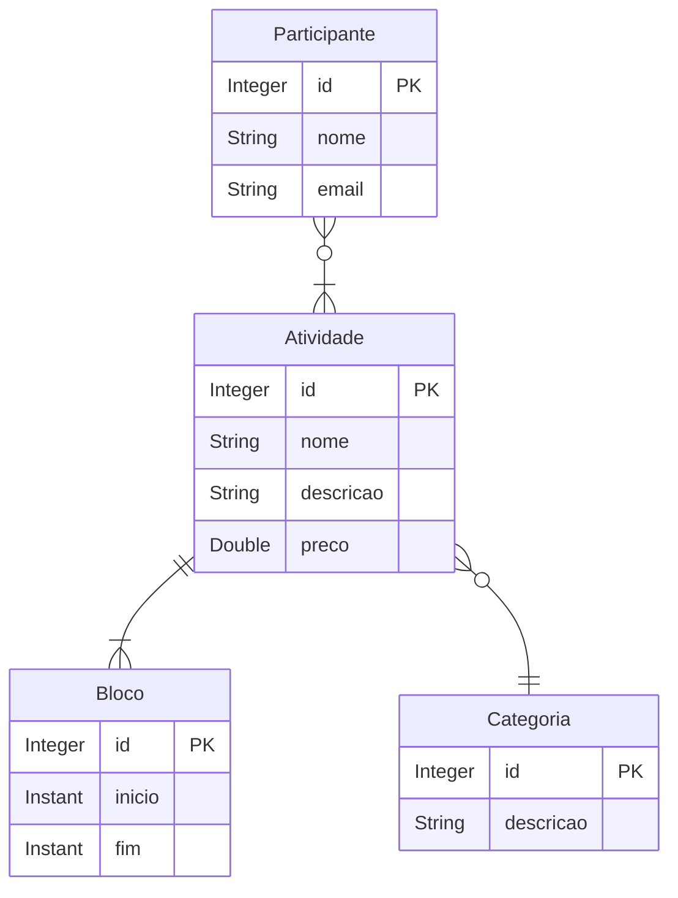
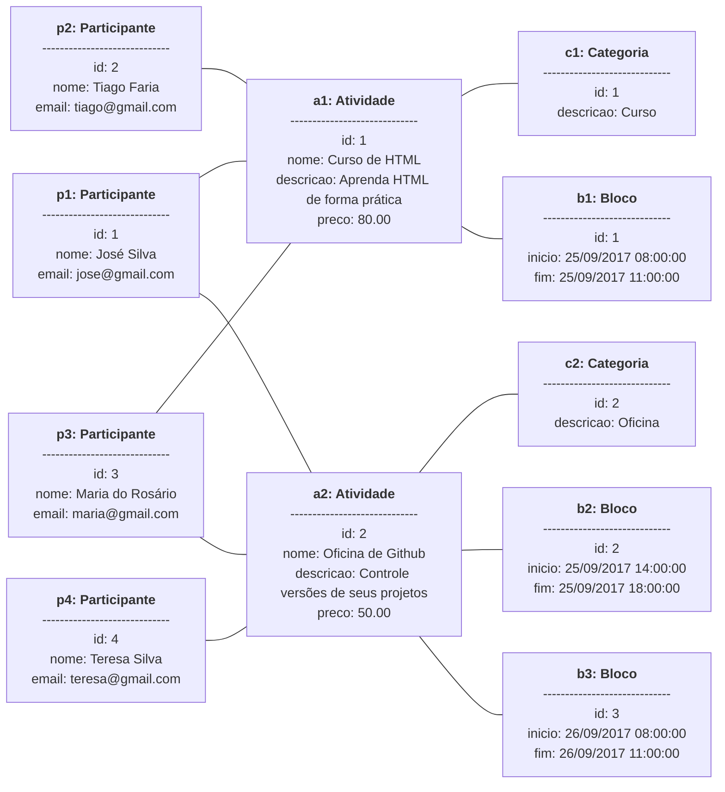

# 📝EVENTS
📍 MY LEARN / JAVA / CHALLENGES / DESVSUPERIOR / JAVA SPRING ESSENTIAL / DOMAIN MODEL AND ORM<br>
📅 July 25, 2023 - 🚩 São Paulo, Brazil - 🧑‍💻 Mauricio Mityo Hidani<br>


## Rodando o projeto

Versões utilizadas no desafio:

- [Java 17](https://www.oracle.com/java/technologies/javase/jdk17-archive-downloads.html)
- [Gradle 8.2.1](https://docs.gradle.org/current/userguide/installation.html)
- [Spring 3.1.2](https://spring.io/projects/spring-boot)

O desafio está armazenado em um diretório específico deste repositório, dessa forma para conseguir realizar o **git clone** deste desafio, clonando apenas este desafio, realize os comandos demonstrados logo abaixo:

```
mkdir myLearn
cd myLearn

git init
git remote add origin https://github.com/mauricioHidani/MyLearn.git
git config core.sparseCheckout true
echo "events/*" >> .git/info/sparse-checkout
git pull origin main

cd events/

gradle build

```

Descrição dos comandos:

1. `mkdir myLearn`: cria um diretório
2. `cd myLearn`: entra no diretório criada
3. `git init`: inicia um repositório _git_ no diretório atual
4. `git remote add origin https://github.com/mauricioHidani/MyLearn.git`: adiciona o endereço remoto do repositório que contém o desafio
5. `git config core.sparseCheckout true`: configura o _sparse-checkout_ para aceitar que a _clonagem_ de um diretório específico do repositório
6. `echo "events/*" >> .git/info/sparse-checkout`: atribui a específicação do diretório à configuração do _git_ que será clonado.
7. `git pull origin main`: clona o repositório trazendo apenas o diretório configurado no _sparse-checkout_
8. `cd events/`: entra no diretório do desafio 
9. `gradle build`: constrói a aplicação/desafio utilizando o _gradle_


Para acessar o H2 e consultar os dados inseridos na base de dados, execute o comando abaixo caso ainda não tenha executado: 

```
gradle run
```

E acesso no navegaro: [http://localhost:8080/h2-console](http://localhost:8080/h2-console)


## Especificações do desafio

Deve-se criar um projeto no Spring Boot com Java e banco de dados H2, e implementar o modelo 
conceitual conforme especificação a seguir. Além disso, você deve fazer o seeding da base de dados 
conforme diagrama de objetos que segue. 

Deseja-se construir um sistema para gerenciar as informações dos participantes das atividades de um 
evento acadêmico. As atividades deste evento podem ser, por exemplo, palestras, cursos, oficinas 
práticas, etc. Cada atividade que ocorre possui nome, descrição, preço, e pode ser dividida em vários 
blocos de horários (por exemplo: um curso de HTML pode ocorrer em dois blocos, sendo necessário 
armazenar o dia e os horários de início de fim do bloco daquele dia). Para cada participante, deseja-se 
cadastrar seu nome e email. 



Instância dos dados para seeding (próxima página):

